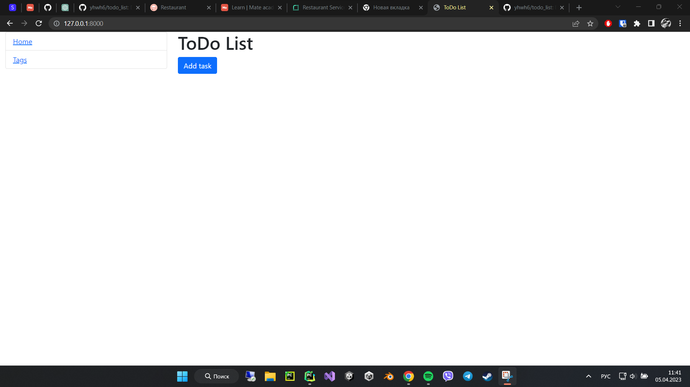
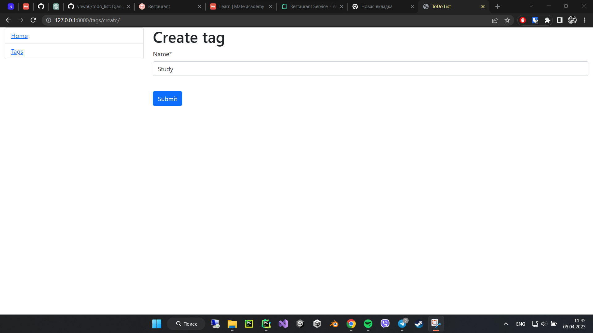
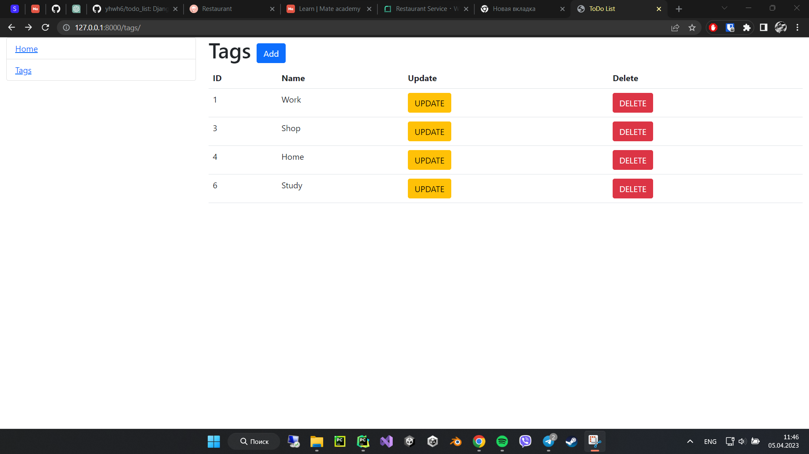
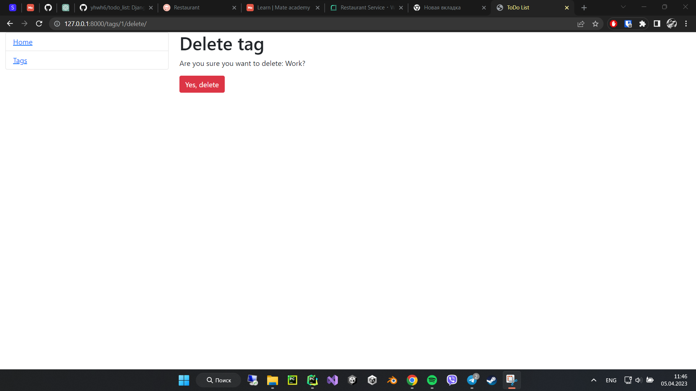
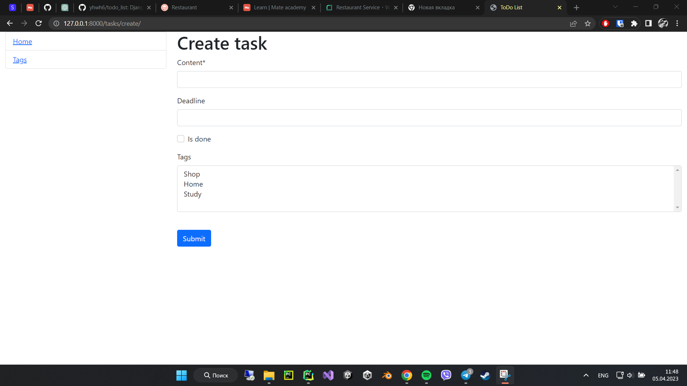
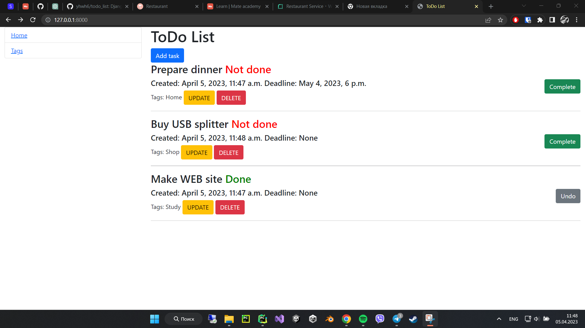

# ToDo list project
Django project for managing tasks

## Installation
Python3 must be already installed

```shell
git clone https://github.com/yhwh6/todo_list.git
cd todo_list
python3 -m venv venv
source venv/bin/activate
pip install -r requirements 
rename .env.sample => .env and place your django key into this file
python manage.py runserver
```

## DEMO





